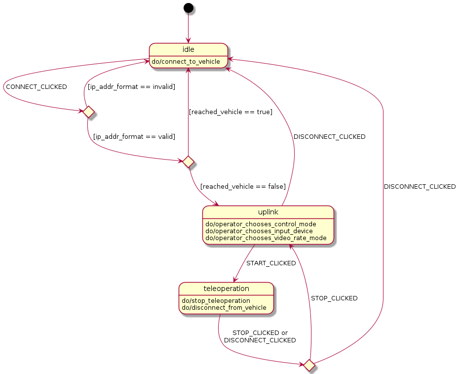

# tod_manager

This ROS package provides the connection establishment between an operator and a vehicle. Therefore, a operator manager node and a vehicle manager node exist. They behave as counterparts and communicate the status message. The operator manager is superior to the vehicle manager.

# Dependencies
  * ROS Packages: see `package.xml`
  * [Qt5](https://www.qt.io/) (Widgets Core Network Test)
    ```
    sudo apt-get install qt5-default -y
    ```
  * yaml-cpp
    ```
    sudo apt-get install libyaml-cpp-dev -y
    ```
  * [PahoMqttCpp](https://github.com/eclipse/paho.mqtt.cpp): Install instructions can be found in the [tod_network](https://github.com/TUMFTM/tod_common/tree/master/tod_network/) package.

# Documentation

## OperatorManager
Provides a GUI for the operator to initiate the connection to the vehicle. Further the operator is able to choose a control mode, input device and video rate mode. The status_msg is circulated between the [OperatorManager](#operatormanager) and [VehicleManager](#vehiclemanager) using MQTT. The status_msg is continously updated. The operator has different buttons to traverse the [State machine](#state-machine).

**Published Topics:**  
  * `/Operator/Manager/status_msg` ([tod_msgs/StatusMsg](https://github.com/TUMFTM/tod_common/blob/master/tod_msgs/msg/Status.msg))

## VehicleManager
Reads the safetry_driver_status, nav_status and pos_type from the vehicle. The status_msg is circulated between the [OperatorManager](#operatormanager) and [VehicleManager](#vehiclemanager) using MQTT. The status_msg is continously updated.

**Published Topics:**
  * `/Vehicle/Manager/status_msg` ([tod_msgs/StatusMsg](https://github.com/TUMFTM/tod_common/blob/master/tod_msgs/msg/Status.msg))

**Subscriptions:**
  * `/Vehicle/VehicleBridge/safety_driver_status` ([tod_msgs/StatusMsg](https://github.com/TUMFTM/tod_common/blob/master/tod_msgs/msg/Status.msg))
  * `/Vehicle/VehicleBridge/gps/nav_status` ([std_msgs/String](http://docs.ros.org/en/melodic/api/std_msgs/html/msg/String.html))
  * `/Vehicle/VehicleBridge/gps/pos_type` ([std_msgs/String](http://docs.ros.org/en/melodic/api/std_msgs/html/msg/String.html))


# Quick start

```
caktin build tod_manager
source devel/setup.zsh
roslaunch tod_manager tod_manager.launch
```
# State machine

The tod_manager can be modelled as a state machine with the following states


